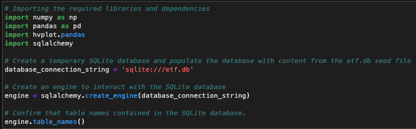
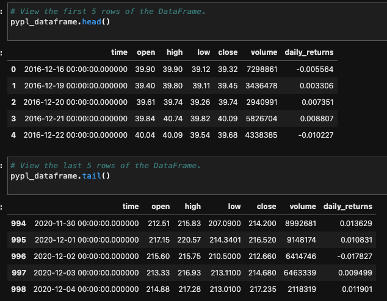
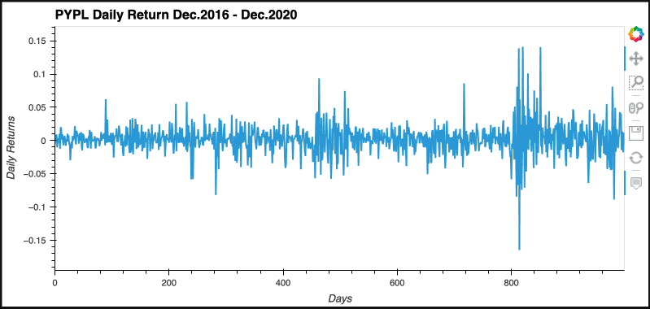
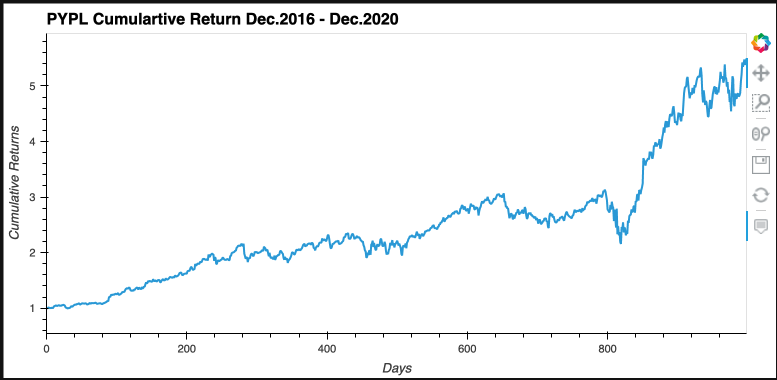
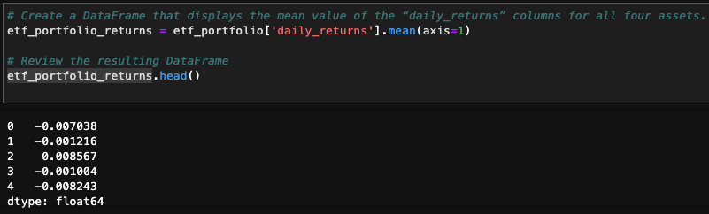
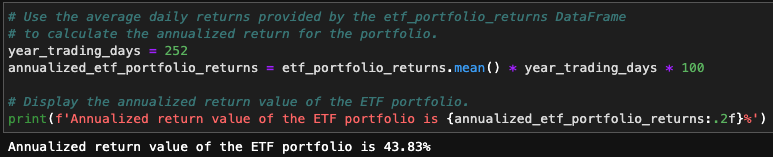
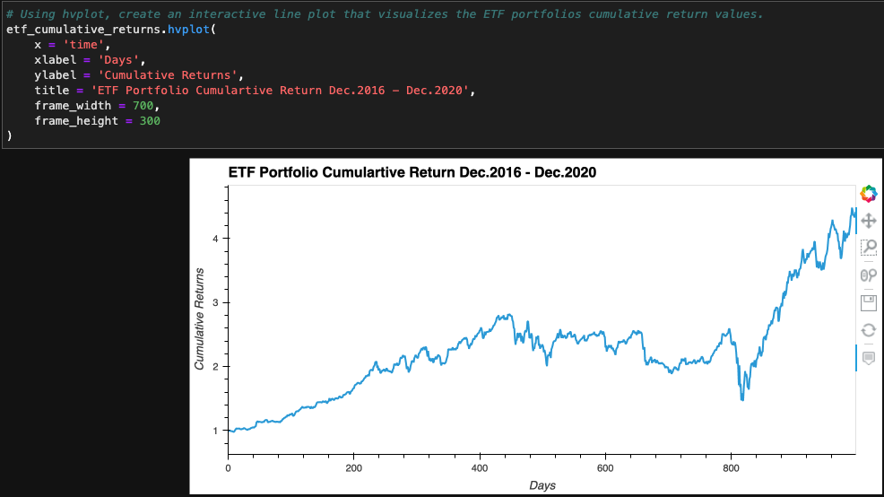
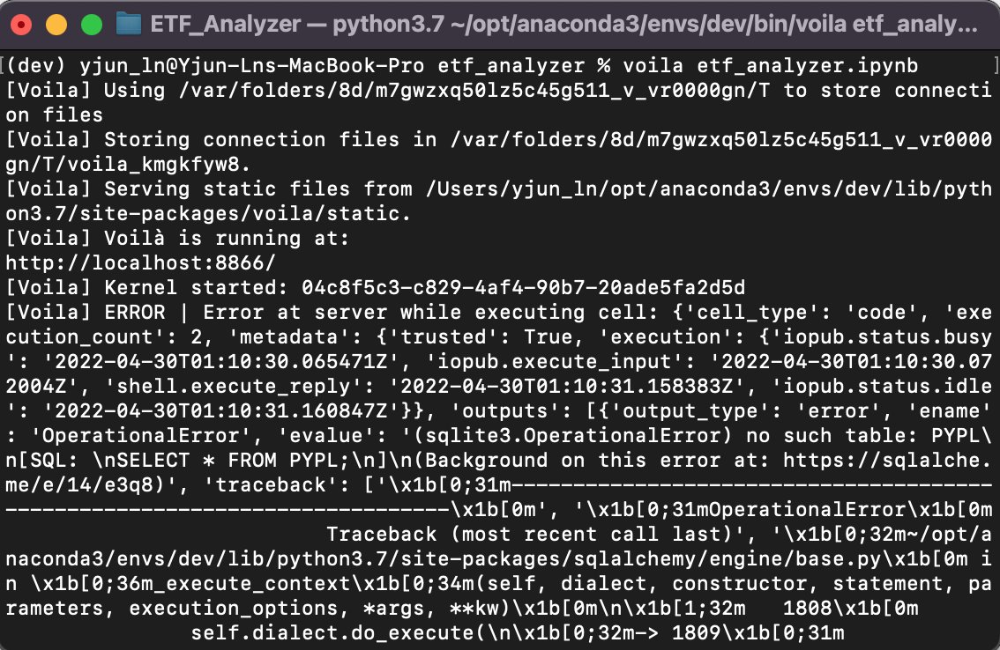
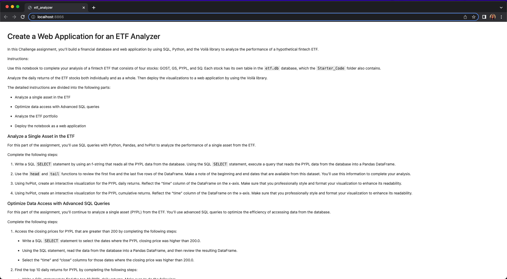

# ETF Analyzer
>As passive investments became more popular in today's financial market, more investors choose to put their money in exchange-traded-funds (ETFs), rather than spend endless hours reseaching individual stocks and analyze each companies 10Ks. ETFs include a wide range of stocks, which delivers a diversified packege to investors. On the other hand, being able to analyze ETFs performances became crutial.

In this Jupyter Notebook file, I will demonstrate how to utilize Python and SQL to analyze ETFs from a database:
    
* Analyze one stock (PYPL) in the ETF

* Analyze the entire ETF portfolio

* Deploy the notebook as a web application using Voila
---

## Technologies
This project leverages python 3.7 with the following packages:

* [pandas](https://pandas.pydata.org/docs/getting_started/overview.html) - To read, calculate, analysis, visualize data

* [numpy](https://numpy.org/doc/stable/user/absolute_beginners.html) - To perform mathmatical calculations

* [hvplot](https://hvplot.holoviz.org/) - Provide interactive visualization

* [voila](https://voila.readthedocs.io/en/stable/using.html) - To convert a Jupyter notebook file into a webpage

* [sqlalchemy](https://docs.sqlalchemy.org/en/14/) - To ease the communication between Python based programs and databses
---

## Installation Guide

Before running the Jupyter notebook file, first, install the following dependencies in Terminal or Bash under the `dev` environment.

```python
  pip install pandas
  pip install SQLAlchemy
  pip install hvplot
  pip install numpy
  conda install -c conda-forge voila
```

---

## General Information
It is necessary to import all libraries and dependencies, create a temporary SQLite database as well as create an engine to interact with the SQLite database.


-- Analyze one stock (PYPL) in the ETF

In order to analyze PYPL, I wrote a SQL `SELECT` statment by using an f-string that reads all the PYPL data from the database, then execute the query that reads the PYPL data from the database into a Pandas DataFrame. To confirm the query was successfully executed and also to review the selected data, I displayed the first and last 5 rows of the dataframe.



To deliver a more user interactive visualization, I used `hvplot` to generate a Daily Return and a Cumulative Return graph of PYPL. 

```python
    pypl_dataframe['daily_returns'].hvplot(
    x = 'time',
    y = 'daily_returns',
    xlabel = 'Days',
    ylabel = 'Daily Returns',
    title = 'PYPL Daily Return Dec.2016 - Dec.2020',
    frame_width = 700,
    frame_height = 300
)
```



```python
# Get PYPL daily returns
daily_returns = pypl_dataframe['daily_returns']
# Calculate cumulative retunrs from daily returns data and add the column to pypl_dataframe
pypl_dataframe['cumulative_returns'] = (1 + daily_returns).cumprod()
# Create an interactive visaulization with hvplot to plot the cumulative returns for PYPL.
pypl_dataframe['cumulative_returns'].hvplot(
    x = 'time',
    y = 'cumulative_returns',
    xlabel = 'Days',
    ylabel = 'Cumulative Returns',
    title = 'PYPL Cumulartive Return Dec.2016 - Dec.2020',
    frame_width = 700,
    frame_height = 300
)
``` 



With the powerful Python and SQL combination, I also make a conditional selection on where the closing price of PYPL is greater than 200 with the following code:

```python
query = """
SELECT time, close 
FROM PYPL
WHERE close > 200.0;
"""
# Use engine to execute the query
engine.execute(query)
# Using the query, read the data from the database into a Pandas DataFrame
pypl_higher_than_200 = pd.read_sql_query(query, con = engine)
```

I was also able to sort the daily returns of PYPL by descending order and selected the top 10 days of highest daily returns with the following code:

```python
query = """
SELECT time, daily_returns
FROM PYPL
ORDER BY daily_returns DESC
LIMIT 10;
"""
# Use engine to execute the query
engine.execute(query)
# Using the query, read the data from the database into a Pandas DataFrame
pypl_top_10_returns = pd.read_sql_query(query, con=engine)
```

-- Analyze the entire ETF portfolio

To work on the entire ETF portfolio, I had to `SELECT` and `JOIN` all the tables in the database by doing the follwoing query:

```python
query = """
SELECT *
FROM GDOT
JOIN GS ON GDOT.time = GS.time
JOIN PYPL ON GDOT.time = PYPL.time
JOIN SQ ON GDOT.time = SQ.time;
"""
# Use engine to execute the query
engine.execute(query)
# Using the query, read the data from the database into a Pandas DataFrame
etf_portfolio = pd.read_sql_query(query, con = engine)
```

Then, I combined all four stocks daily return data and found the average.



With the results above, I calculated the annualized portfolio return.



I also calculated the cumulative protfolio returns with the following code:

```python
etf_cumulative_returns = (1 + etf_portfolio_returns).cumprod()
```
Finally, I was able to plot the portfolio cumulative return over the 4 years into an interactive line plot using `hvplot`.



-- Deploy the notebook as a web application using Voila

Last but not least, to deliver my analysis, I used `Voila` to deploy this Jupyter notebook file as a web application using the command line.



And the webpage looks like below:




In conclusion, utilizing both Python and SQL to analyze the ETFs allowed me to create a temporary database, select portion of the data from the database with conditional queries. Once I get target dataframe, I was able to calculate and plot user interactive graphs to visualize the results. 

---

## Contributors

UC Berkeley Extension

Brought you by **Yanjun Lin Andrie**

* yanjun.lin.andrie@gmail.com

* https://www.linkedin.com/in/yanjun-linked

---

## License

MIT
